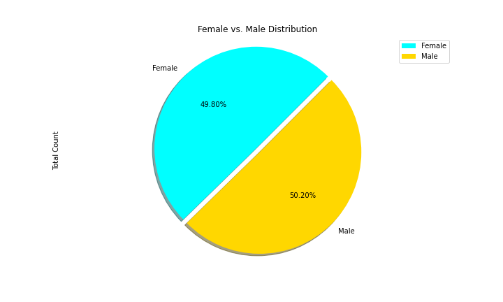

# Pymaceuticals
### Summary. 
This project focuses on affects of drugs on mice and tumors over time. The analysis and visualizations were generated using Pandas and Matplotlib. The analysis reveals that there is a weak positive correlation between weight and tumor volume, which means the greater. 

### Figure 1

### Figure 2

### Figure 3

### Figure 4

### Figure 5

