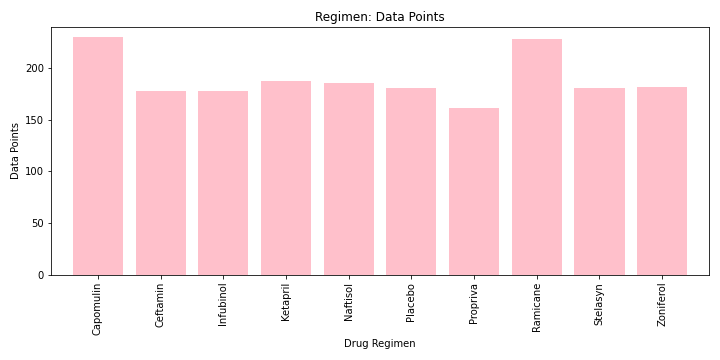

# Pymaceuticals
### Summary. 
This project focuses on affects of drugs on mice and tumors over time. The analysis and visualizations were generated using Pandas and Matplotlib. The analysis reveals that there is a weak positive correlation between weight and tumor volume, which means that a slight increase in weight, can possibly increase the tumor volume of a mouse.

### Figure 1: Treatment data points

### Figure 2: Gender Distribution

### Figure 3: Capomulin

### Figure 4: Top four drug regimen

### Figure 5: Survival Rates

